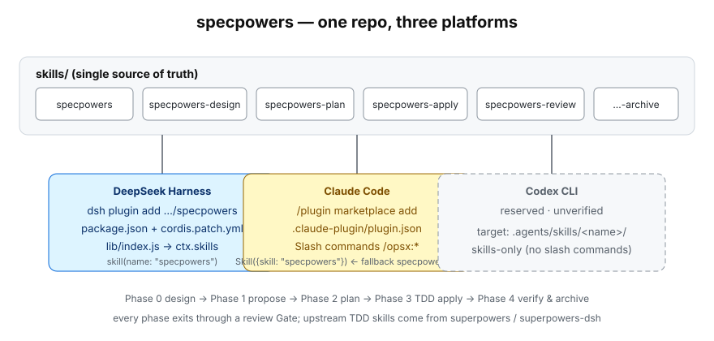

<div align="center">

**English** | [简体中文](README.md)

</div>

# specpowers

**SDD + TDD engineering development methodology** — DeepSeek Harness plugin + Claude Code skill group

specpowers blends [OpenSpec](https://github.com/Fission-AI/OpenSpec) (spec-driven development) with [Superpowers](https://github.com/obra/superpowers) (test-driven discipline), bridging the two into a complete **Phase 0→4 development workflow** through a set of adapter instructions. It prevents requirement drift (building things nobody needs) and implementation defects (building the needed things wrong), and its stage-by-stage review Gates across the whole workflow guard against context rot and deliverable-quality decay.



## Skill Group Architecture

```
specpowers (entry — decision tree + routing + state machine)
  ├── specpowers-design  Phase 0+1: requirements clarification → OpenSpec format conversion
  ├── specpowers-plan    Phase 2: OpenSpec → TDD plan bridging
  ├── specpowers-apply   Phase 3: subagent-driven TDD implementation + Gate 3 review
  ├── specpowers-review  review system: two-tier routing (critical/full) / final read-through
  └── specpowers-archive Phase 4: hard Gate chain verification + archiving
```

| Skill | Phase | Responsibility |
|-------|-------|----------------|
| **specpowers** | Global | Execution-mode decision (tiny/medium/complex/large-scale) + routing + state machine |
| **specpowers-design** | 0+1 | brainstorming → OpenSpec format conversion + Gate 0/1 |
| **specpowers-plan** | 2 | writing-plans bridging + Gate 2 |
| **specpowers-apply** | 3 | subagent-driven TDD, one task at a time + code-review + spec-compliance-check |
| **specpowers-review** | Cross-cutting | Two-tier routing (auto-decided by rounds × size: critical/full review) / anti-degradation mechanisms |
| **specpowers-archive** | 4 | Full test suite → openspec validate → archive → integrity verification |

## Installation

### Prerequisites

| Tool | Purpose | Installation check |
|------|---------|--------------------|
| **DeepSeek Harness** or **Claude Code** | Runtime environment | `dsh --version` / `claude --version` |
| **superpowers-dsh** (DSH) or **Superpowers** (Claude Code) | TDD skill group (**hard dependency**) | see Dependency Setup below |
| **OpenSpec CLI** | SDD spec management (**hard dependency**) | `openspec --version` |
| **CodeGraph** (optional) | Code knowledge graph | `.codegraph/` directory at repo root / MCP `codegraph_explore` |
| **Graphify** (optional) | Multimodal knowledge graph (architecture understanding) | `/graphify` command |

### Install in DeepSeek Harness

Simplest — run from any directory:

```sh
npx @deepseek-ai/dsh plugin --profile web add github:SAXEM1997/specpowers
```

After installation, restart the profile (stop it and run `dsh web` / `npx @deepseek-ai/dsh web` again), then refresh the browser.

You can also let DeepSeek Harness install it itself — open a new conversation and send it this message:

```
Please install the plugin from this link: https://github.com/SAXEM1997/specpowers
```

Restart and verify the layer has been composed:

```sh
dsh --profile web --dump-config     # a specpowers line must appear
```

Afterwards the 6 skills appear in the agent skill catalog (`specpowers` is the entry skill) and can be loaded with the `skill` tool.

To uninstall:

```sh
dsh plugin --profile web remove specpowers
# restarting the profile is likewise required after uninstalling
```

> You must use the `dsh plugin` form — a plain `npm install specpowers` only installs the package as an ordinary library into the current directory and **never** registers it into any profile, so the skills would never be loaded.

### Install in Claude Code

**Option 1: Plugin Marketplace (recommended)**

```bash
/plugin marketplace add https://github.com/SAXEM1997/specpowers.git
/plugin install specpowers@specpowers-marketplace
```

**Option 2: Manual installation**

```bash
git clone https://github.com/SAXEM1997/specpowers.git
cp -r specpowers/skills/* ~/.claude/skills/
cp -r specpowers/commands/* ~/.claude/commands/
```

### Dependency Setup

specpowers itself ships only the workflow skills; two dependency groups must be installed separately. The `.claude/` directory is **user-local generated content** — it is not distributed with this repository and must be regenerated by the steps below.

**1. OpenSpec CLI (required)**

```bash
npm install -g @fission-ai/openspec
openspec init --tools claude     # Claude Code: generates .claude/skills/openspec-*/ and .claude/commands/opsx/
openspec init --tools codex      # Codex: generates .agents/skills/openspec-*/
```

The `openspec-*` skills and `/opsx:*` commands generated by `openspec init` are owned by OpenSpec and refreshed by `openspec update` — do not hand-edit them.

**2. Superpowers skill group (required)**

DSH users:

```sh
npx @deepseek-ai/dsh plugin --profile web add superpowers-dsh
```

Claude Code users: install the `superpowers` plugin.

specpowers hard-depends on **8** upstream skills; when one is missing, the corresponding Phase cannot run:

`brainstorming`, `writing-plans`, `subagent-driven-development`, `test-driven-development`, `systematic-debugging`, `requesting-code-review`, `verification-before-completion`, `finishing-a-development-branch`

**3. CodeGraph / Graphify (optional)** — affects architecture-understanding capability only, not workflow execution.

### Project Initialization

To enable specpowers in a target project:

```
□ Run openspec init (generates the openspec/ directory and tool integrations)
□ Install the superpowers skill group (see above)
□ Create the docs/superpowers/ directory structure
□ Configure TEST_COMMAND (full test command, optional)
```

See `skills/specpowers/refs/project-template.md` for the project template.

## Quick Start

Trigger it in natural language:

- "Start the specpowers workflow"
- "Develop this feature with SDD+TDD"
- "Begin the specpowers workflow for this new feature"

Claude Code users can also use the `/specpowers` slash command. DSH users simply load the entry skill directly: `skill(name: "specpowers")`.

### Execution Modes

The entry skill decides automatically by file count + complexity:

| Mode | Files | Phase flow | Review |
|------|-------|------------|--------|
| **Tiny** | 1-3 | Light exploration → subagent execution → done | Auto-decided by two-tier routing |
| **Medium** | 4-19 | Full Phase 0→1→2→3→4 pipeline | Auto-decided by two-tier routing |
| **Complex** | 20-49 | Phase 2 enables UltraPlan | Auto-decided by two-tier routing |
| **Large-scale** | 50+ | Phase 2 enables Workflow | Auto-decided by two-tier routing |

## Phase Workflow

```
Phase 0: requirements clarification + approach design (brainstorming)
  ├── explore project context
  ├── ask clarifying questions in sequence
  ├── approach discussion + design presentation (section-by-section approval)
  ├── write the design doc + self-review
  └── approval Gate → Gate 0 review
       ↓
Phase 1: OpenSpec format conversion + cross-check verification
  ├── design doc → OpenSpec four-piece set (proposal/design/specs/tasks)
  ├── mandatory cross-check verification (vs original requirements)
  └── manual review → Gate 1 review
       ↓
Phase 2: bridging stage (writing-plans)
  ├── OpenSpec artifacts → Superpowers TDD plan
  ├── granularity conversion + scenario→test mapping
  └── Gate 2 review
       ↓
Phase 3: subagent-driven TDD implementation
  ├── each task executed by an independent sub-agent (fresh context)
  ├── RED-GREEN-REFACTOR-COMMIT executed per task
  ├── code-review + spec-compliance-check
  └── Gate 3 review
       ↓
Phase 4: verification + archiving
  ├── full test suite Gate
  ├── openspec validate Gate
  ├── /opsx:archive Gate
  └── integrity verification Gate
```

## Review System

The review tier is decided automatically by the two-tier routing matrix inside specpowers-review (review rounds × artifact size × line-count floor); users can override manually:

- **Critical**: tiny tasks end-to-end, medium tasks from round 2 on (alignment + supervision, 2 agents, ~0.4x tokens)
- **Full**: first-round reviews, complex/large-scale tasks; code artifacts fork into bucket sub-paths — reinforced review (4-9 files: code-review + single alignment pass) / UltraReview (≥10 files: 6-agent team); document artifacts use a 3-agent multi-model progressive review

All anti-degradation mechanisms are preserved, with additional guards for tier routing.

### Multi-Model Progressive Review

Three agents review independently in parallel, each on a different model: **structure agent** (completeness/redundancy/consistency, strong-reasoning model), **grounding agent** (executability/compatibility/edge cases, fast model), **alignment agent** (alignment with original requirements/omission detection/ambiguity identification, a model different from the other two).

### UltraReview

A 6-agent team review (build/code/specs/docs/deps/alignment) with a Step A-F per-finding analysis protocol.

### Convergence Check

After every Gate review a convergence verdict is emitted (marked `[CONVERGENCE_CHECK]`), computed from this round's raw finding counts p*_raw against 5 trigger conditions (any one met → continue another round by default): ① p0_raw > 1; ② p1_raw > 5; ③ P0+P1+P2 combined > 10; ④ all levels combined > 20; ⑤ this round's p1_raw grew by more than 3 versus the previous round. Exit happens only when none are met or the user explicitly terminates (action=exit), followed by the final read-through. Anti-laziness companions: RAW_COUNT structured counting + totals cross-check + severity-calibration sampling whenever p0_raw ≥ 1.

## Platform Adaptation

| Platform | Skill invocation form | Skill source path | Status |
|---|---|---|---|
| **DeepSeek Harness** | `skill(name: "specpowers")` | plugin package `skills/`, registered into the host skill registry by the `lib/index.js` provider | ✅ Implemented |
| **Claude Code** | bare name when available: `Skill({skill: "specpowers"})`; falls back to `Skill({skill: "specpowers:specpowers"})` when the skill registry requires a plugin namespace | `skills: "./skills"` in `.claude-plugin/plugin.json` | ✅ Implemented |
| **Codex CLI** | skill called by bare name (skills-only tooling) | `.agents/skills/<name>/SKILL.md` | 🔲 Reserved · **Unverified** |

For the full mapping of platform differences (tool correspondence, degradation paths when hooks or slash commands are missing) see `skills/specpowers/refs/platform-tools.md`.

## Repository Layout

```
specpowers/
├── package.json                       # DSH plugin manifest (dsh.bundle.patch)
├── cordis.patch.yml                   # DSH bundle-layer patch
├── lib/index.js                       # DSH skill provider (ctx.skills)
├── scripts/verify-dsh-provider.mjs    # packaging self-check (zero dependencies)
├── .claude-plugin/                    # Claude Code manifests
│   ├── marketplace.json
│   └── plugin.json
├── skills/                            # ★ the single source of truth for skills on both platforms
│   ├── specpowers/SKILL.md            # entry skill
│   │   ├── refs/                      # getting-started guide, project template, UltraPlan prompt, platform adaptation
│   │   └── scripts/                   # state machine / guard / hook validation (zero dependencies)
│   ├── specpowers-design/SKILL.md     # Phase 0+1
│   ├── specpowers-plan/SKILL.md       # Phase 2
│   ├── specpowers-apply/SKILL.md      # Phase 3
│   ├── specpowers-review/SKILL.md     # review system
│   └── specpowers-archive/SKILL.md    # Phase 4
├── commands/specpowers.md             # Claude Code /specpowers command
├── static/architecture.svg            # architecture diagram
├── docs/superpowers/{specs,plans}/    # this project's designs and plans (development history)
├── AGENTS.md                          # vendor-neutral project instructions (source of truth)
├── CLAUDE.md                          # Claude Code entry (imports AGENTS.md)
├── README.md / README.en.md
└── LICENSE
```

`.claude/` (OpenSpec-generated) and `.superpowers/` (runtime state) are user-local content, excluded via `.gitignore`.

## Development

Skill files are Markdown + YAML frontmatter. After editing, make sure the frontmatter `name` and `description` are well-formed, cross-skill reference names match reality, and required sub-skill paths are correct.

Run the packaging self-check (zero dependencies; validates manifest validity + the provider `list()`/`get()` contract + relative-resource reachability):

```bash
node scripts/verify-dsh-provider.mjs
```

> **Required reading before changing the frontmatter parser**: DSH routes skills solely by `description`. The parser in this repo's `lib/index.js` supports 4 scalar forms (single-line, folded blocks `>`/`>-`, literal blocks `|`/`|-`, and multi-line plain continuations). If it degrades to single-line scalars only, the `description` of `specpowers` and `specpowers-review` collapses to the literal strings `">"`/`">-"`, and the `description` of `specpowers-design` and `specpowers-plan` gets truncated — the skills become visible but never selectable. Always run `node scripts/verify-dsh-provider.mjs` after changing the parser.

The skill eval suite lives in `skills/*/evals/`: declarative YAML cases plus rule-based assertions. The runner is the open-source [skill-up](https://github.com/alibaba/skill-up) project (Alibaba, Apache-2.0); this repo's `eval.yaml` (`schema_version: v1alpha1`) and `cases/*.yaml` are its eval format.

```bash
curl -fsSL https://raw.githubusercontent.com/alibaba/skill-up/main/install.sh | bash
```

```bash
skill-up validate <path>
skill-up run <path>
```

`<path>` is the skill directory (a skill's `evals/` sits next to its `SKILL.md`); `validate` checks the cases and `run` executes the suite, writing output to `<skill>-workspace/` in that directory (e.g. `iteration-1/result.json`), which `.gitignore` already excludes. skill-up ships four built-in Agent Engines — `claude_code` / `codex` / `qodercli` / `qwen_code` — plus custom engines via `engine.custom`; **DeepSeek Harness is not a built-in engine**, so the suite must run under one of those built-in engines or a custom engine. See the [upstream docs](https://alibaba.github.io/skill-up/) for authoring new cases.

See [AGENTS.md](AGENTS.md) for the development workflow and key design decisions.

## License

MIT, see [LICENSE](LICENSE). Upstream skill content is adapted from [Superpowers](https://github.com/obra/superpowers) (MIT, Copyright (c) 2025 Jesse Vincent) and [OpenSpec](https://github.com/Fission-AI/OpenSpec) (MIT, Copyright (c) 2024 OpenSpec Contributors); the full upstream copyright notices are in the upstream-attribution section of LICENSE.
